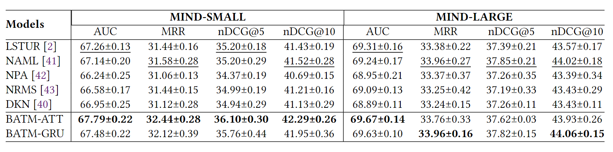

# Explainable News Recommender System

## Introduction

This repository contains the code for the papers [A Novel Perspective to Look At Attention: Bi-level Attention-based
Explainable Topic Modeling for News Classification](https://arxiv.org/pdf/2203.07216.pdf)
and [Topic-Centric Explanations for News Recommendation](https://arxiv.org/pdf/2306.07506.pdf).
The implementation is based on Pytorch and includes _news classification_ and _news recommendation_ tasks. We also
provide a procedure to
generate _explainable topic_ for both news classification task and news recommender system.

## Usage

Clone the repository and install the dependencies.

```bash
git clone https://github.com/Ruixinhua/ExplainableNRS
cd ExplainableNRS
pip install -r requirements.txt
```

Download the MIND dataset from [here](https://msnews.github.io/). The dataset is licensed under the
[Microsoft Research License Terms](https://go.microsoft.com/fwlink/?LinkID=206977). We suggest to use the following
commands to download the processed dataset and pre-trained GloVe word embedding.

```bash
cd dataset
# Download GloVe pre-trained word embedding and preprocessed MIND dataset
wget https://nlp.stanford.edu/data/glove.840B.300d.zip
apt install unzip
unzip glove.840B.300d.zip -d glove
rm glove.840B.300d.zip
mkdir MIND && cd MIND
gdown https://drive.google.com/uc?id=1JUq6UzeGVYifpyupjOD11aKZjaG0Elur
unzip small.zip -d small
rm small.zip
cd ../utils
gdown https://drive.google.com/uc?id=1bC4WgcVrDOAmjVu2o2jR-aETGqbLbveI
gdown https://drive.google.com/uc?id=15vV-dBLXnleRvT_011VDGizmSjk6o-yF
```

To run the code for training the basic BATMRS model and evaluating its performance, follow these commands:

```bash
cd ../../ # back to the root directory
export PYTHONPATH=PYTHONPATH:./:./modules  # set current directory and the module directory as PYTHONPATH
accelerate launch modules/experiment/runner/run_baseline.py --task=RS_BATM --arch_type=BATMRSModel --subset_type=small --news_info=use_all --news_lengths=100 --word_dict_file=MIND_40910.json --ref_data_path=dataset/utils/ref.dtm.npz --topic_evaluation_method=fast_eval,w2v_sim 
# use default configuration of accelerate to launch the training script; add "--config_file config.yaml" after launch to use the configuration file
# check [accelerate documentation](https://huggingface.co/docs/accelerate/) for more details
```

## Evaluation

The performance of baselines are summarized in the following table. The results can be obtained by running the code with
the default configuration:


Recommendation performance and Topic quality evaluation results are shown in the following table with
different configurations of the BATM-ATT model in a NR task:

| #Topic | variant | test\_group\_auc | test\_mean\_mrr | test\_ndcg\_5 | test\_ndcg\_10 |
|:-------|:--------|:-----------------|:----------------|:--------------|:---------------|
| 10     | base    | 67.43±0.21       | 32.12±0.34      | 35.78±0.32    | 42.04±0.27     |
| 30     | base    | 67.51±0.14       | 32.16±0.22      | 35.88±0.21    | 42.10±0.18     |
| 50     | base    | 67.65±0.22       | 32.36±0.15      | 36.04±0.21    | 42.26±0.19     |
| 70     | base    | 67.56±0.17       | 32.16±0.31      | 35.85±0.33    | 42.10±0.29     |
| 100    | base    | 67.47±0.19       | 32.14±0.26      | 35.90±0.26    | 42.01±0.25     |
| 150    | base    | 67.38±0.39       | 32.24±0.30      | 35.88±0.37    | 42.08±0.34     |
| 200    | base    | 67.10±0.37       | 32.01±0.44      | 35.56±0.54    | 41.85±0.47     |
| 300    | base    | 66.97±0.39       | 31.94±0.28      | 35.42±0.33    | 41.64±0.34     |
| 500    | base    | 67.22±0.37       | 32.15±0.25      | 35.71±0.30    | 41.94±0.22     |

| #Topic | variant | original\_c\_npmi | PP60\_c\_npmi     | original\_w2v\_sim | PP60\_w2v\_sim    |
|:-------|:--------|:------------------|:------------------|:-------------------|:------------------|
| 10     | base    | 0.0852±0.0075     | 0.1179±0.0221     | 0.2579±0.0184      | 0.2743±0.0218     |
| 30     | base    | 0.0735±0.0273     | 0.1039±0.025      | 0.2360±0.0268      | 0.2526±0.0272     |
| 50     | base    | 0.0796±0.0162     | 0.1116±0.0161     | 0.2444±0.0125      | 0.2589±0.0183     |
| 70     | base    | 0.0838±0.0261     | 0.1114±0.0311     | 0.2427±0.0259      | 0.2560±0.0324     |
| 100    | base    | 0.0681±0.0059     | 0.1002±0.0073     | 0.2199±0.0057      | 0.2364±0.0095     |
| 150    | base    | 0.0872±0.0126     | 0.1172±0.0146     | 0.2536±0.0083      | 0.2659±0.0117     |
| 200    | base    | 0.0988±0.0101     | 0.1248±0.0110     | 0.2778±0.0066      | 0.2874±0.0079     |
| 300    | base    | 0.1044±0.0085     | 0.1270±0.0101     | 0.2978±0.0048      | 0.2989±0.0062     |
| 500    | base    | **0.1140±0.0054** | **0.1382±0.0057** | **0.3035±0.0078**  | **0.3108±0.0064** |

BATM-ATT model with variational inference:

| #Topic | variant     | test\_group\_auc | test\_mean\_mrr | test\_ndcg\_5  | test\_ndcg\_10 |
|:-------|:------------|:-----------------|:----------------|:---------------|:---------------|
| 30     | variational | **67.63±0.09**   | **32.44±0.06**  | **36.14±0.03** | **42.31±0.02** |
| 50     | variational | 67.51±0.24       | 32.16±0.07      | 35.89±0.22     | 42.06±0.13     |
| 70     | variational | 67.16±0.36       | 31.79±0.33      | 35.46±0.37     | 41.71±0.33     |
| 100    | variational | 66.35±0.30       | 31.34±0.29      | 34.83±0.37     | 41.07±0.32     |

| #Topic | variant     | original\_c\_npmi | PP60\_c\_npmi | original\_w2v\_sim | PP60\_w2v\_sim |
|:-------|:------------|:------------------|:--------------|:-------------------|:---------------|
| 30     | variational | 0.0624±0.0157     | 0.0917±0.0148 | 0.2274±0.0132      | 0.2412±0.0208  |
| 50     | variational | 0.0886±0.0284     | 0.1178±0.0358 | 0.2549±0.0231      | 0.2648±0.0342  |
| 70     | variational | 0.1022±0.0025     | 0.1392±0.0072 | 0.2675±0.0023      | 0.2903±0.0047  |
| 100    | variational | 0.1022±0.0092     | 0.1271±0.0018 | 0.2748±0.0181      | 0.2805±0.0114  |

BATM-ATT model with entropy regularization:

| #Topic | variant                  | test\_group\_auc | test\_mean\_mrr | test\_ndcg\_5 | test\_ndcg\_10 |
|:-------|:-------------------------|:-----------------|:----------------|:--------------|:---------------|
| 30     | with-entropy-static-1e-5 | 67.50±0.21       | 32.01±0.24      | 35.65±0.27    | 41.81±0.26     |
| 50     | with-entropy-static-1e-5 | 67.21±0.18       | 32.09±0.28      | 35.65±0.26    | 41.80±0.28     |
| 70     | with-entropy-static-1e-5 | 67.18±0.25       | 32.32±0.13      | 35.80±0.22    | 41.92±0.20     |

| #Topic | variant                  | original\_c\_npmi | PP60\_c\_npmi | original\_w2v\_sim | PP60\_w2v\_sim |
|:-------|:-------------------------|:------------------|:--------------|:-------------------|:---------------|
| 30     | with-entropy-static-1e-3 | 0.0800±0.0228     | 0.1027±0.0198 | 0.3411±0.0262      | 0.3555±0.0368  |
| 50     | with-entropy-static-1e-3 | 0.0913±0.0100     | 0.1130±0.0051 | 0.3379±0.0211      | 0.3348±0.0281  |
| 70     | with-entropy-static-1e-3 | 0.0997±0.0052     | 0.1149±0.0043 | 0.3310±0.0143      | 0.3213±0.0141  |

| #Topic | variant                   | test\_group\_auc | test\_mean\_mrr | test\_ndcg\_5 | test\_ndcg\_10 |
|:-------|:--------------------------|:-----------------|:----------------|:--------------|:---------------|
| 30     | with-entropy-dynamic-1e-3 | 67.62±0.21       | 31.96±0.29      | 35.72±0.36    | 41.87±0.26     |
| 50     | with-entropy-dynamic-1e-3 | 67.61±0.14       | 32.06±0.30      | 35.83±0.30    | 41.91±0.27     |
| 70     | with-entropy-dynamic-1e-3 | 67.62±0.12       | 32.12±0.08      | 35.86±0.20    | 42.03±0.10     |
| 100    | with-entropy-dynamic-1e-3 | 67.55±0.18       | 32.22±0.23      | 35.90±0.28    | 42.13±0.21     |
| 150    | with-entropy-dynamic-1e-3 | 67.41±0.24       | 32.20±0.40      | 35.87±0.40    | 42.01±0.35     |
| 200    | with-entropy-dynamic-1e-3 | 67.29±0.04       | 32.16±0.17      | 35.78±0.17    | 41.86±0.13     |

| #Topic | variant                   | original\_c\_npmi | PP60\_c\_npmi | original\_w2v\_sim | PP60\_w2v\_sim |
|:-------|:--------------------------|:------------------|:--------------|:-------------------|:---------------|
| 30     | with-entropy-dynamic-1e-3 | 0.0634±0.0164     | 0.0875±0.0167 | 0.2393±0.0194      | 0.2501±0.0161  |
| 50     | with-entropy-dynamic-1e-3 | 0.0581±0.0072     | 0.0881±0.0028 | 0.2186±0.0118      | 0.2255±0.0143  |
| 70     | with-entropy-dynamic-1e-3 | 0.0625±0.0070     | 0.0917±0.0114 | 0.2258±0.0095      | 0.2392±0.0199  |
| 100    | with-entropy-dynamic-1e-3 | 0.0943±0.0140     | 0.1201±0.0121 | 0.2580±0.0044      | 0.2671±0.0045  |
| 150    | with-entropy-dynamic-1e-3 | 0.0962±0.0039     | 0.1212±0.0067 | 0.2903±0.0250      | 0.2946±0.0151  |
| 200    | with-entropy-dynamic-1e-3 | 0.1054±0.0095     | 0.1217±0.0135 | 0.3068±0.0065      | 0.3000±0.0059  |

## Credits

- Dataset by **MI**crosoft **N**ews **D**ataset (MIND), see <https://msnews.github.io/>.
- Reference news recommendation repository by _yusanshi_, see <https://github.com/yusanshi/news-recommendation> 